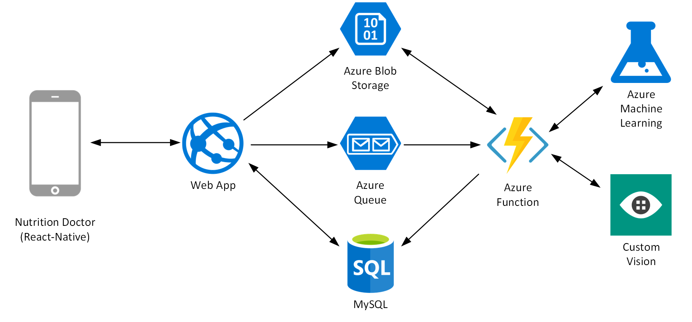
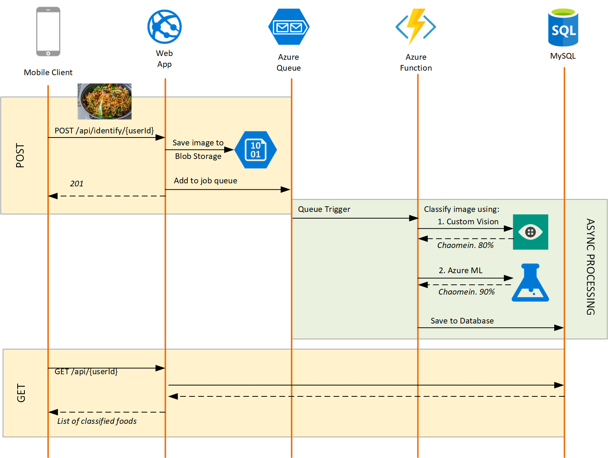

# Ping An Nutrition Doctor - Web Api

During the Microsoft One Week Hackathon, we [Microsoft] collaborated with Ping An to build Nutrition Doctor. Nutrition Doctor is an application that allows users to take a photo of a food item whereupon the app will identify the food item and present the user with nutritional information such as calories, fat, etc. 

## Architecture

----

Each component is separated into their own Git repository:

* [Mobile Client](https://github.com/CatalystCode/NutritionDoctor)
* [Web Api](https://github.com/CatalystCode/NutritionDoctorApi)
* [Functions](https://github.com/CatalystCode/NutritionDoctorFunctions)
* [Image Classifier](https://github.com/CatalystCode/NutritionDoctorImageClassifier)

## Getting Started

The Web API is a stateless ASP.NET Core application that exposes two REST APIs and communicates with Azure Blob Storage (for image persistence), Azure Queue (for asynchronous image processing), and MySQL (for data persistence).

1. `git clone git@github.com:CatalystCode/NutritionDoctorApi.git`
2. Open `NutritionDoctorApi.sln` in Visual Studio 2017
3. `F5` to Debug